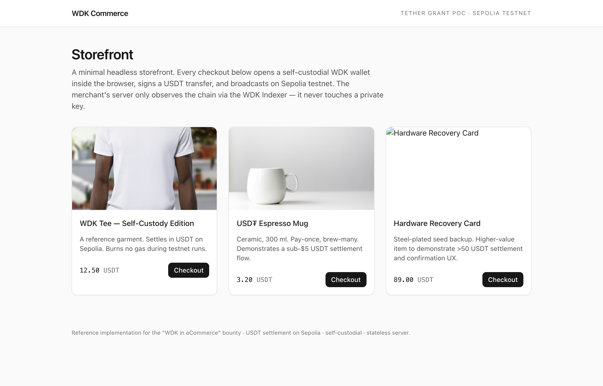
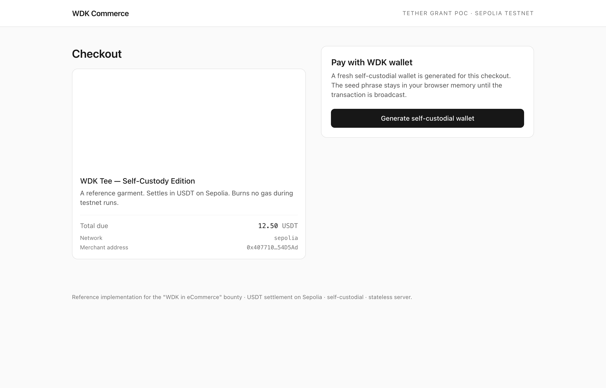
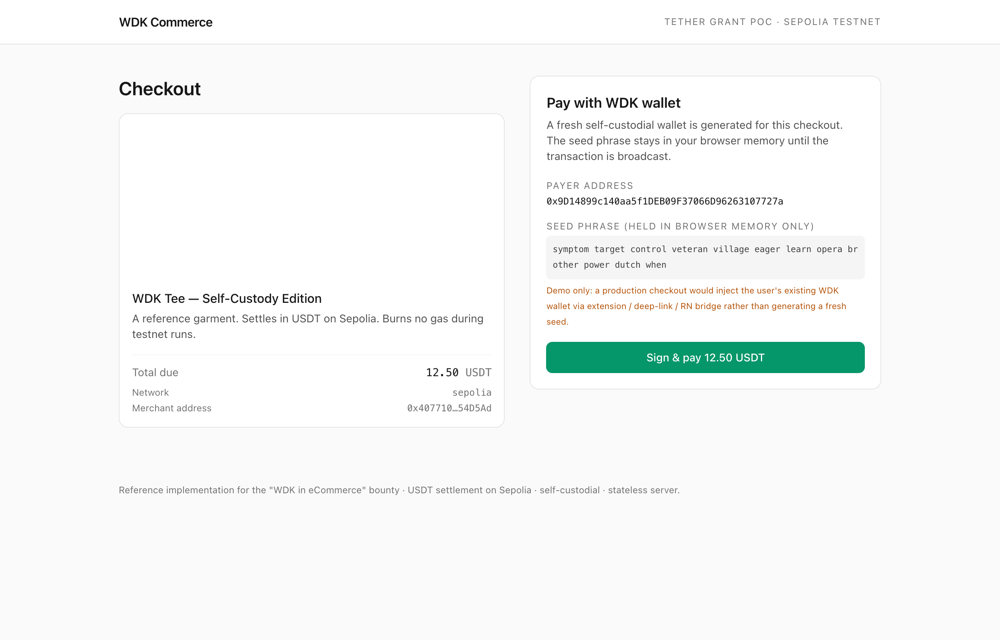
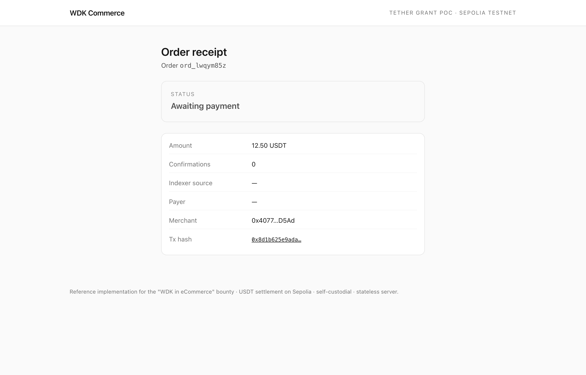

# WDK Commerce — self-custodial checkout reference

Reference implementation submitted to the [Tether developer grant program](https://tether.dev/grants/bounties/2800541093) — **"WDK in eCommerce" bounty (3,000 USDT)**.

It demonstrates how a headless storefront can accept self-custodial USDT
payments using only:

- [`@tetherto/wdk`](https://github.com/tetherto/wdk-core) for seed / account
  management
- [`@tetherto/wdk-wallet-evm`](https://github.com/tetherto/wdk-wallet-evm) for
  ERC-20 transfer signing
- [WDK Indexer API](https://docs.wdk.tether.io/tools/indexer-api) for
  payment confirmation (with a public-RPC fallback so reviewers can run the
  demo without an API key)

> **Scope of this snapshot.** This repository is the milestone-0 (pre-M1)
> walking skeleton. The architecture and milestone plan target the bounty's
> full deliverables (plugin/SDK, merchant integration walkthrough, demo
> video). See [Roadmap](#roadmap).

## Run locally

```bash
git clone https://github.com/hitome0123/wdk-ecom-poc.git
cd wdk-ecom-poc
pnpm install        # or npm install
cp .env.local.example .env.local
# edit NEXT_PUBLIC_MERCHANT_ADDRESS to a Sepolia address you control,
# optionally add WDK_INDEXER_API_KEY (https://wdk-api.tether.io/register)
pnpm dev
```

Open <http://localhost:3000>, pick a product, generate a wallet, fund it
with Sepolia ETH + Sepolia USDT (faucets:
[Google Cloud Web3](https://cloud.google.com/application/web3/faucet/ethereum/sepolia)
for ETH, [pk910 PoW](https://sepolia-faucet.pk910.de/) as a backup), then pay.

USDT is the trickier side — public USDT faucets on Sepolia are rare. The
repo ships a one-shot helper that calls the Aave V3 permissionless
faucet contract directly from the buyer wallet, so reviewers don't have
to connect a separate wallet just to top up:

```bash
BUYER_SEED="twelve words from /api/wallet/new" \
  node scripts/mint-usdt.mjs
# → 100 test USDT minted to the same address WDK derives
```

### Live demo evidence (Sepolia)

End-to-end smoke run captured against the local server on this snapshot:

| Field        | Value |
| ------------ | ----- |
| Buyer        | `0x9D14899c140aa5f1DEB09F37066D96263107727a` |
| Merchant     | `0x4077106d13f03054915ae146033fC4aFd354D5Ad` |
| Amount       | 12.50 USDT |
| WDK tx hash  | [`0x8d1b625e9adaa51ba5156916dc1082e05f2d8c9e6831f1a6d1a32644ba4d3ee5`](https://sepolia.etherscan.io/tx/0x8d1b625e9adaa51ba5156916dc1082e05f2d8c9e6831f1a6d1a32644ba4d3ee5) |
| Result       | Status `0x1` (success) at block 10842334 — buyer 100 → 87.50 USDT, merchant 0 → 12.50 USDT |

The transfer was signed by WDK (`account.transfer({ token, recipient, amount })`)
and broadcast through the configured RPC. Anyone can verify the value
flow on Etherscan with the link above.

### Visual walkthrough

Captured headlessly via `scripts/capture-walkthrough.mjs` (Playwright +
the merchant's own Chrome) against the same Sepolia tx as above. The
script intercepts `/api/wallet/new` so the funded buyer wallet is reused
— that way the receipt panel shows a real on-chain success instead of a
fresh empty wallet.

| Step | Screenshot |
| ---- | ---------- |
| 1. Storefront |  |
| 2. Checkout intro |  |
| 3. Wallet generated |  |
| 4. Receipt (on-chain success) |  |

To regenerate locally:

```bash
BUYER_SEED="twelve words ..." \
BUYER_TX=0x8d1b625e9adaa51ba5156916dc1082e05f2d8c9e6831f1a6d1a32644ba4d3ee5 \
  node scripts/capture-walkthrough.mjs
```

## Architecture

```
buyer browser                  Next.js server                chain
─────────────                  ──────────────                ─────
storefront ─ POST /api/orders ─▶  orders.ts (in-mem)
checkout   ─ POST /api/wallet/new ─▶  WDK.getRandomSeedPhrase
           ◀──── seed + address ──────
           ─ POST /api/pay ──────▶  WDK transferToken ──────▶ Sepolia
                                                                │
receipt    ─ GET  /api/orders/:id/stream (SSE) ◀── WDK Indexer ◀┘
                                              (or RPC fallback)
```

Key files

| File                                       | Purpose                                          |
| ------------------------------------------ | ------------------------------------------------ |
| `src/lib/chain.ts`                         | Single source of truth for network config        |
| `src/lib/catalog.ts`                       | Demo product catalog                             |
| `src/lib/orders.ts`                        | Stateless order ledger (swap for Postgres)       |
| `src/lib/indexer.ts`                       | WDK Indexer wrapper + RPC fallback               |
| `src/app/api/wallet/new/route.ts`          | Seed/account generator (PoC server-side, see note) |
| `src/app/api/pay/route.ts`                 | Builds + broadcasts the USDT transfer            |
| `src/app/api/orders/[id]/stream/route.ts`  | SSE pushing live status to buyer + merchant      |

## Security & self-custody notes

The bounty deliverable requires self-custodial flows. This pre-M1 snapshot
generates the seed server-side for fast iteration; the **M2 deliverable
will move all seed handling into a browser-only Web Worker** so the
merchant server never sees keys. The `/api/wallet/new` and `/api/pay`
endpoints are scoped so this migration is a one-file change — the
Indexer/SSE layer is already key-free and stays as-is.

## SDK extraction design

The M2 deliverable extracts the payment surface into a standalone
package (`@wdk-commerce/core`) that the Shopify app, WooCommerce
plugin, and any custom drop-in all consume. See
[`packages/core/README.md`](packages/core/README.md) for the target
file layout, public API, migration plan, and open questions.

## Roadmap (mapped to bounty milestones)

- **M1 — Proposal & Platform Selection (20%)** — this README, architecture
  diagram, choice of headless Next.js + Sepolia USDT, integration plan for
  Shopify / WooCommerce adapters.
- **M2 — Core Payment Flow (40%)** — browser-only key generation; signed
  transfers via WDK in a Web Worker; production-grade order persistence
  (SQLite/Postgres); Indexer API integration with confirmation thresholds
  configurable per merchant.
- **M3 — Final Delivery (40%)** — Shopify app + WooCommerce plugin
  adapters re-using the core SDK; merchant setup guide for
  non-blockchain-specialists; 3-min demo video; transaction smoke tests on
  Sepolia + mainnet (Polygon).

## License

MIT (to be confirmed with bounty grant terms).
